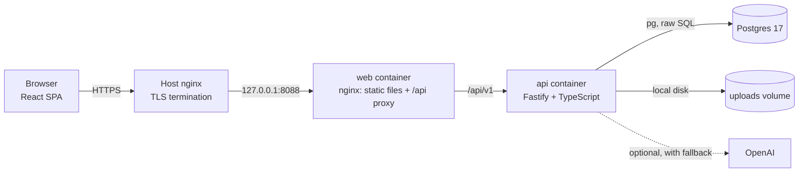
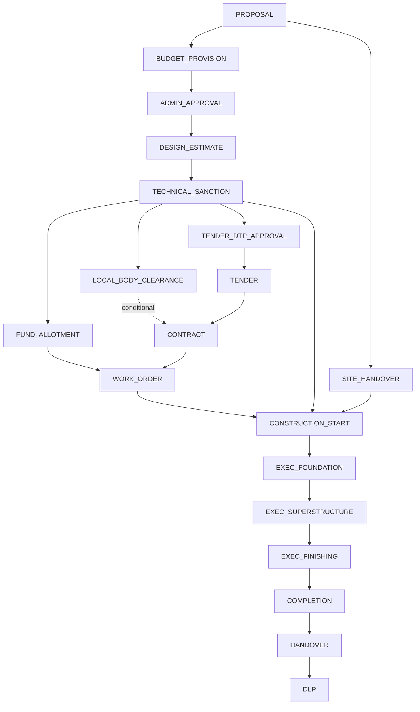
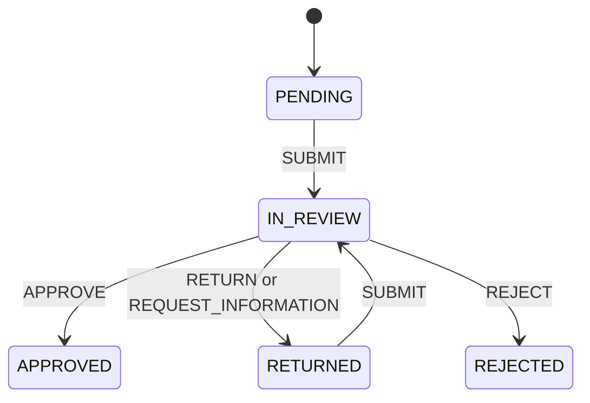

# InfraFlow

**A source-backed, rule-driven workflow and monitoring platform for Gujarat public-works building projects.**

InfraFlow turns a project's facts (department, type, cost, jurisdiction, site status) into a **dependency-graph workflow** by evaluating a **versioned rule registry**. Approvals are routed to a **position, not a person**, by an **authority resolver that refuses to guess**. A **blocker engine** shows the root cause of delay and how many steps it holds back. Construction progress, inspections, evidence and issues feed back into the same graph, and an **advisory AI Copilot** explains everything with rule citations. Every business action is audited.

- Live demo: https://infroflow.chatapp.sbs (synthetic data only, persona buttons on the login page)
- Repository: https://github.com/aaryashah1010/Pravi_project

> **Technical prototype.** The rule registry is pending departmental and legal review. The only monetary delegation thresholds in the system are a **synthetic demo matrix**, labelled as such everywhere. The real R&B department deliberately has no delegation configured, so its approvals show "manual review required" instead of a guessed answer.

---

## Table of contents

1. [The problem](#1-the-problem)
2. [What InfraFlow does](#2-what-infraflow-does)
3. [Design principles (non-negotiables)](#3-design-principles-non-negotiables)
4. [Architecture](#4-architecture)
5. [How the engine works](#5-how-the-engine-works)
6. [Data model](#6-data-model)
7. [Demo data and personas](#7-demo-data-and-personas)
8. [Getting started (local development)](#8-getting-started-local-development)
9. [Configuration reference](#9-configuration-reference)
10. [Demo walkthrough](#10-demo-walkthrough)
11. [Testing](#11-testing)
12. [API reference](#12-api-reference)
13. [Web application](#13-web-application)
14. [Deployment](#14-deployment)
15. [Operations: backup, reset, logs](#15-operations-backup-reset-logs)
16. [Security notes](#16-security-notes)
17. [Troubleshooting](#17-troubleshooting)
18. [Known limitations and roadmap](#18-known-limitations-and-roadmap)
19. [Repository layout and documentation map](#19-repository-layout-and-documentation-map)

---

## 1. The problem

Executing a public building project involves dozens of dependent steps (budget provision, administrative approval, design and estimate, technical sanction, clearances, tender, contract, work order, construction, inspection, completion, handover) across offices and officers. Today:

1. **Hard-coded bureaucracy.** Software bakes approval chains into code (`if cost > X route to Y`). When policy changes, the software has to change.
2. **People-centric routing.** Work is assigned to named individuals. When an officer is transferred, the file stalls.
3. **Linear processing.** Independent steps (for example a local-body clearance and a tender paper approval) are forced into a sequence.
4. **No root cause.** Delay is visible as "the project is late", not as "this one step, waiting this long, is holding back these seven".
5. **Untrustworthy AI.** A general chatbot will confidently invent government rules.

## 2. What InfraFlow does

| Capability | What it means in the product |
|---|---|
| **Rule registry** | Every rule is versioned and linked to a stored source and citation. A rule is executable only when it is `ENFORCEABLE` and `VERIFIED` and inside its effective dates. Unknown means "Not verified", never a guess. |
| **Generated workflow** | On submit, project facts are evaluated against the registry and a 19-node dependency graph is generated. Missing facts leave a step as "Conditional, pending verification" rather than silently skipping it. |
| **Position-based routing** | Tasks and approvals belong to a position at an office. The current holder is resolved when the page is read, so a transfer changes who sees the work without touching the work. |
| **Authority resolver** | Finds the competent position from verified delegation rules, cost bands and office hierarchy. If it cannot resolve a single answer it says so and asks for manual assignment. |
| **Approvals** | Submit, approve, return, reject, request information. Reasons are mandatory for return and reject. Double submits are rejected with `409`. |
| **Blocker engine** | Finds the frontier step that is holding back the most downstream work, and shows why (open issue, rejection, or overdue against its configured SLA). Copy never blames a person. |
| **Bidirectional graph navigation** | Click any step to see what it depends on (trace upward to the root cause) and what it unlocks (impact downward). |
| **Construction tracking** | Milestones with planned, contractor-reported and inspector-verified progress. Reported progress is advisory; only an inspector can raise verified progress. |
| **Field inspections** | Checklist, GPS location, photo evidence (SHA-256 hashed), pass, fail or observation. A failed inspection automatically raises a blocking quality issue. |
| **Issues** | Raised against workflow steps as `BLOCKS`, `AFFECTS` or `INFORMS`, feeding the blocker engine. |
| **Documents and evidence** | Upload, versioning, verification and rejection with reasons, download with permission checks. |
| **AI Copilot** | Explains blockers, suggests next actions, lists missing documents, summarises, and explains why a step is required. Advisory only, grounded in supplied context, cites only rules it was given. Works offline through a deterministic provider. |
| **Audit** | Append-only audit trail plus a transactional outbox that feeds notifications. |
| **Dashboards** | Portfolio KPIs, items needing attention, urgent approvals and an SLA overdue watch. |

## 3. Design principles (non-negotiables)

These are enforced by code review, tests and the `rules-guardian` audit agent.

1. **No ORM.** Raw SQL through `pg`. SQL lives only in `*.repo.ts` files and `infraflow-gov-project/db/`.
2. **No invented government rules.** No hard-coded thresholds, clauses, citations or SLAs-as-law. A configured SLA is labelled "configured, not statutory".
3. **A rule is executable if and only if** `enforcement_mode = 'ENFORCEABLE' AND verification_status = 'VERIFIED' AND effective dates cover today`. Non-executable rules can never block, route or approve.
4. **AI is advisory only.** There is no code path from AI output to approvals, rules, workflow or project state. Output always carries `requires_human_review: true`.
5. **Route by position, not person.** The holder is resolved at read time from `v_current_position_holders`.
6. **Same-transaction audit and outbox.** Every mutation writes its state change, `audit_logs`, and `domain_events` (plus transitions and decisions where relevant) in one database transaction. Append-only tables are protected by triggers.
7. **Synthetic data only.** No real officer names. A "DEMO DATA" chip is on every screen.
8. **Optimistic concurrency.** `version_no` on projects and tasks, and `SELECT ... FOR UPDATE` on approval decisions, so conflicting actions return `409 STATE_CONFLICT`.

## 4. Architecture



### Technology

| Layer | Choice |
|---|---|
| Runtime | Node 22, npm workspaces (no pnpm) |
| API | Fastify 5, TypeScript, zod validation, `@fastify/jwt`, `@fastify/multipart`, `@fastify/rate-limit` |
| Database | PostgreSQL 17, raw SQL, plain migrations tracked with checksums |
| Web | React 18, Vite, TypeScript (strict), Tailwind CSS 3, TanStack Query 5, React Router 6, `@xyflow/react` with `@dagrejs/dagre` for the graph |
| AI | Provider-agnostic gateway: OpenAI (default `gpt-4o-mini`) or a deterministic offline provider |
| Files | Local disk (`storage_provider = 'LOCAL'`), SHA-256 per version |
| Auth | Email and password, JWT (HS256, 8 hours). Roles and permissions are computed by the server on every request |
| Packaging | Docker Compose: Postgres, API, nginx |
| Tests | Vitest: domain unit tests, database integration tests, API flow tests |

Fonts and icons are bundled (`@fontsource/*`, `material-symbols`), so the UI works without internet. Only the optional OpenAI call needs connectivity.

### Repository modules

```
apps/api/src/modules/<name>/
   <name>.routes.ts    HTTP: validation, permission guards
   <name>.service.ts   use cases, transactions, audit + events
   <name>.repo.ts      ALL SQL for the module
   domain/*.ts         pure logic, no HTTP or DB imports, unit-tested
```

Cross-module calls go through the other module's service, never its tables. Modules: `auth`, `org`, `rules`, `projects`, `workflows`, `authority`, `approvals`, `tasks`, `documents`, `notifications`, `dashboards`, `audit`, `issues`, `construction`, `inspections`, `contracts`, `ai`.

Pure domain logic that is tested in isolation: rule status, the rule condition DSL, workflow planning, authority decision, blocker analysis, AI guardrails.

### Request lifecycle for a mutation

1. Route authenticates the JWT, loads the actor (roles, permissions, positions), and checks the permission.
2. Service opens one transaction (`withTx`), locks what it needs (`lockProject`, then case or node), and applies the change.
3. In the same transaction it writes `audit_logs`, `domain_events`, and where relevant `workflow_transitions` and `approval_decisions`.
4. `recompute(project)` propagates: activates newly ready steps, spawns tasks and approval cases, auto-completes gates, and updates the project's lifecycle stage and status.
5. After commit, a dispatcher turns outbox events into notifications. An in-process ticker marks overdue tasks.

The service receives `ctx.now` and uses it for every business timestamp. That is what lets the scenario seeder build backdated but genuine history through the real code paths.

## 5. How the engine works

### 5.1 Rule executability

```
executable(rule, date) =
    enforcement_mode = 'ENFORCEABLE'
    AND verification_status = 'VERIFIED'
    AND effective_from <= date <= effective_to (open-ended allowed)
```

The database also enforces `ENFORCEABLE` implies `VERIFIED`. Each workflow node records the rule version that produced it, so a generated workflow stays reproducible after rules change.

Every step carries a **`gateKind`**, computed from its rule:

| gateKind | Meaning | Shown as |
|---|---|---|
| `RULE_BACKED` | An executable, verified rule requires this step | "Mandatory gate (verified rule)" |
| `CONFIGURED` | Operational structure of the template with no rule behind it | "Configured prerequisite" |
| `ADVISORY` | Backing rule is not enforceable (currency check required) | "Advisory (rule not enforceable)" |
| `CONDITIONAL_PENDING` | Applicability depends on a fact that is not yet known | "Conditional, pending verification" |
| `NOT_APPLICABLE` | Condition evaluated false | "Not applicable" |

Only `RULE_BACKED` is ever called a "mandatory gate".

### 5.2 Rule condition DSL

Conditions are JSON, evaluated with three-valued logic:

```json
{ "all": [ { "fact": "attributes.local_body_approval_required", "op": "eq", "value": true } ] }
```

Operators: `eq neq gt gte lt lte in exists`. Combinators: `all`, `any`, `not`. Facts come from the project, its site, the department code and the jurisdiction chain. **A missing fact yields `INDETERMINATE`**, which leaves the dependent step conditional instead of skipping it. Each evaluation is stored in `rule_evaluations` with an explanation.

### 5.3 Workflow template `GOV_BUILDING_STD` (19 nodes, 22 edges)



Node types: `APPROVAL` (admin approval, technical sanction, tender paper approval, completion), `CLEARANCE`, `MILESTONE` (three construction phases), `GATE` (construction start), `INFORMATION` (defect liability period), and `TASK` or `DOCUMENT` for the rest. Each step has an SLA in days that is **configured for the demo, not statutory**.

**Step states.** `INACTIVE` (waiting) becomes `ELIGIBLE` when every gating predecessor is complete, then `ACTIVE` (submitted or started), then `COMPLETED`. Side states are `BLOCKED` (open blocking issue), `NOT_APPLICABLE` and `SKIPPED`. Only `BLOCKING` and `REQUIRES_COMPLETION` edges gate a step. `INFORMATIONAL` and `PARALLEL` never block. Edges touching a not-applicable step are disabled so they never block forever.

### 5.4 Authority resolver (never guesses)

1. **Candidates.** Active authority rules that match department, project type, cost band and dates, and whose linked rule version is executable. Zero candidates means `NO_RULE`, which routes to manual review.
2. **Selection.** Highest specificity, then lowest priority number. A tie is `AMBIGUOUS`.
3. **Office.** By routing scope: the owning office, or the office covering the project's jurisdiction, walking up the hierarchy nearest-first.
4. **Holder.** The current holder of the position, primary assignment before acting or additional charge. A vacant nearer seat is never skipped: it yields `INACTIVE_POSITION`, which routes to manual review.
5. **Persist.** The resolution and its full snapshot are stored. An administrator with `authority.manual_assign` can assign a position with a reason, which is audited.

Cost bands are inclusive at both ends, so adjacent bands are seeded with the upper band starting at `max + 0.01` to avoid an accidental tie.

### 5.5 Approvals



Guard order on every decision: authenticated, has `approval.decide`, **actor currently holds the resolved position** (otherwise `403 INSUFFICIENT_SCOPE`), case is `IN_REVIEW`, row lock (a double click gives `409 STATE_CONFLICT`), predecessors complete, required documents present and none rejected. Decisions are append-only rows with the actor, their position and the reason.

### 5.6 Blocker analysis

A **frontier** step is incomplete, applicable, has at least one gating successor, and all of its gating predecessors are complete. A frontier step is reported as a blocker only if it has an open blocking issue, a rejected approval, or is overdue against its configured SLA. Blockers are ranked by open blocking issue, then overdue, then number of downstream steps held back, then age. Downstream impact is a recursive walk over active gating edges.

The copy is fixed: "Current root blocker candidate: X. It is preventing N downstream steps from becoming ready."

### 5.7 Construction and inspections

- A milestone has **planned**, **reported** (contractor, advisory) and **verified** (inspector) progress. Variance is computed from verified progress only.
- Verified progress can never decrease and cannot be set by a failed inspection.
- Submitting an inspection: every checklist item must be answered, a pass cannot contain failed items, and a fail or observation needs written observations.
- A **FAIL** raises a high-severity quality issue that blocks the milestone's workflow step and creates a rectification task. It stays blocked until the issue is resolved and re-inspected.
- Photos are uploaded against the inspection with their GPS coordinates and SHA-256 hash.

### 5.8 AI Copilot and guardrails

- **Gateway.** `OpenAiProvider` when `OPENAI_API_KEY` is set, otherwise (or on timeout or error) `DeterministicProvider`, which builds answers from the same context with templates. The UI labels the source: "AI-generated" or "Rule-based summary".
- **Context builder.** Deterministic and permission-filtered: project facts, blocker analysis, node states, executable rule versions with provenance, missing documents. Nothing else is sent, so there is no cross-project leakage.
- **Guardrails.** Any rule code in an answer that is not in the supplied context is stripped and flagged. Sentences that claim an official action ("I have approved...", "the AI waived...") are replaced. `requires_human_review` is forced to `true`. There is no write path from AI to workflow, approvals or rules.
- Runs are recorded in `ai_runs` and audited. Rate limit: 30 requests per minute per user.
- Endpoints: explain blocker, next actions, missing documents, summarise, why required, and free-form ask.

### 5.9 Events, audit, notifications

`domain_events` is an outbox: rows are written in the same transaction as the change, and only `published_at` and `publication_attempts` may be updated afterwards. A dispatcher fans events out to notifications for the affected positions and users. `audit_logs`, `approval_decisions`, `variation_decisions`, `workflow_transitions` and `domain_events` are append-only, enforced by database triggers.

## 6. Data model

About 85 tables across these groups (raw SQL migrations `001` to `023` in `infraflow-gov-project/db/migrations/`):

| Group | Tables (selection) |
|---|---|
| Reference | `project_types`, `document_types`, `funding_sources` |
| Identity and RBAC | `app_users`, `roles`, `permissions`, `role_permissions`, `user_role_assignments`, `contractor_users` |
| Organisation | `organizations`, `jurisdictions`, `offices`, `positions`, `position_types`, `user_position_assignments`, view `v_current_position_holders` |
| Projects | `projects`, `project_sites`, `project_members`, `project_proposals`, `project_budget_allocations`, `design_estimate_packages`, `boq_items` |
| Rules | `rule_sources`, `rule_versions`, `rule_citations`, `rule_evaluations`, `rule_activation_log` |
| Authority | `authority_rules`, `authority_resolutions` |
| Workflow | `workflow_templates`, `workflow_node_templates`, `workflow_edge_templates`, `workflow_instances`, `workflow_node_instances`, `workflow_instance_dependencies`, `workflow_transitions`, `tasks` |
| Approvals | `approval_cases`, `approval_decisions`, `sanctions`, `clearances` |
| Documents | `documents`, `document_versions`, `project_required_documents`, `evidence_links` |
| Procurement and contract | `contractors`, `contractor_project_assignments`, `tenders`, `contracts`, `work_orders` |
| Construction | `milestones`, `milestone_updates`, `inspections`, `inspection_checklist_results`, `measurements`, `bills`, `issues`, `issue_workflow_links` |
| Platform | `audit_logs`, `domain_events`, `notifications`, `notification_recipients`, `ai_runs`, `ai_citations`, `ai_suggestions` |

Migrations `001` to `022` are frozen; changes go in a new numbered file. Migration `023` adds the credentials column, the user-to-contractor link, the outbox trigger fix (only `published_at` may change), a per-document SHA-256 uniqueness fix, project code sequence, deadlines on nodes and a few other gaps found while building.

Seeds are idempotent (`ON CONFLICT ... DO NOTHING`). The migration runner records each file with a checksum in `_migrations` and refuses to run if an applied file was edited.

Money is `NUMERIC(18,2)` and travels as strings, never floats.

## 7. Demo data and personas

Everything is synthetic. All accounts are `<name>@demo.infraflow.local` with password **`Demo@12345`**. The login page has one-click persona buttons.

| Login | Role | Seat |
|---|---|---|
| `officer` | Department officer: creates and submits projects, completes early tasks | District officer |
| `engineer` | Technical officer: verifies documents, requests inspections, updates milestones | Assistant Engineer, Division |
| `approver` | Approving authority | Executive Engineer, Division |
| `se` | Approving authority | Superintending Engineer, District |
| `inspector` | Field inspector: submits geo-tagged inspections, raises issues | Junior Engineer, Division |
| `monitor` | Monitoring officer: read-only dashboards, audit, Copilot, cross-department view | Monitoring Officer, District |
| `contractor` | Reports progress (advisory), uploads documents, raises issues, requests inspections | Linked through `contractor_users` |
| `admin` | System administrator: manual authority assignment, sees tasks on vacant seats | none |

### Synthetic delegation matrix (department `DEMO-GOV` only)

| Decision | Up to | Above |
|---|---|---|
| Administrative approval | 5 crore: Executive Engineer | 5 crore: Superintending Engineer |
| Technical sanction | 15 crore: Executive Engineer | 15 crore: Superintending Engineer |
| Tender paper approval | 5 crore: Executive Engineer | 5 crore: Superintending Engineer |
| Completion certification | Executive Engineer | not applicable |

These rows are marked `synthetic` in the database and shown with an amber **SYNTHETIC DEMO** badge, never the green "Verified source" badge. The real R&B department (`GJ-RNB`) has no delegation rules, so its approvals resolve to `MANUAL_REVIEW`.

### Seeded rule pack

25 rule versions, 6 sources and 25 citations, taken from the project's research documents. Highlights: `RNB-WF-001/002/003`, `RNB-TS-001`, `RNB-TND-001`, `RNB-CNT-001`, `RULE-001/004/005/006/007` are enforceable and verified. `RNB-WF-004`, `RNB-BLD-002` and `RNB-CNT-002` are conditional. `RNB-BLD-001` and `RNB-TND-002` are advisory pending a currency check. `RULE-010` and `RULE-012` are contract-specific. Where a source section number is not recorded, the citation reads "Locator to be captured".

### Seeded projects

They are created by `scripts/seed-scenarios.ts` through the real services on a backdated clock, so each has a genuine audit trail, transitions, approvals and events.

| Code | State | What it shows |
|---|---|---|
| `DEMO-INF-0001` | Fresh, 12 crore school, not yet submitted | The live flow: submit, graph generation, approval routing |
| `DEMO-INF-0002` | Construction, blocked | Superstructure reported 65% but verified 42%, a failed inspection, an open utility issue blocking the step, and a pending re-inspection |
| `DEMO-INF-0003` | Pre-construction, at risk | Site handover pending 8 days against a 3-day configured SLA, blocking construction start and 6 more steps |
| `DEMO-INF-0004` | Real R&B department | Authority unresolved, manual review (visible to monitor and admin) |

## 8. Getting started (local development)

### Prerequisites

- Node.js 22 and npm 10
- Docker Desktop (or Docker Engine with the Compose plugin)
- Free ports: `5455` (Postgres), `4000` (API), `5173` (web)

### Steps

```bash
git clone https://github.com/aaryashah1010/Pravi_project.git
cd Pravi_project

npm install

# 1. Postgres in Docker (host port 5455)
npm run db:up

# 2. Create schema, load reference data, and build the demo projects (about a minute)
npm run db:demo

# 3. API on :4000 and web on :5173
npm run dev
```

Open http://localhost:5173 and use a persona button.

The API reads `.env` first and falls back to `.env.example`, so no setup is needed for local use. Copy `.env.example` to `.env` when you want to set an `OPENAI_API_KEY` or change values.

### Scripts

| Command | What it does |
|---|---|
| `npm run db:up` / `db:down` | Start or stop the Postgres container |
| `npm run db:migrate` | Apply pending migrations (tracked with checksums) |
| `npm run db:seed` | Idempotent seeds and demo password hashes |
| `npm run db:reset` | Development only: drop the schema, migrate, seed |
| `npm run seed:scenarios` | Build the four demo projects through the real services |
| `npm run db:demo` | `db:reset` then `seed:scenarios` |
| `npm run db:psql` | Open `psql` in the database container |
| `npm run dev` | API and web with reload |
| `npm test` | Full test suite |
| `npm run typecheck` | Type-check API and shared package |
| `npm run build -w @infraflow/web` | Type-check and build the web app |

The development Postgres container runs with `fsync=off` for speed. Do not use it for real data. The production compose file does not.

## 9. Configuration reference

All values are environment variables.

| Variable | Default | Purpose |
|---|---|---|
| `NODE_ENV` | `development` | `production` enables trusted-proxy handling |
| `DATABASE_URL` | dev URL on port 5455 | Main database |
| `TEST_DATABASE_URL` | `infraflow_test` on 5455 | Database used by the test suite |
| `API_PORT` | `4000` | API listen port |
| `JWT_SECRET` | dev value | **Required.** Minimum 16 characters, use 32 or more random characters in production |
| `JWT_EXPIRES_IN` | `8h` | Token lifetime |
| `CORS_ORIGINS` | `http://localhost:5173,...` | Comma-separated allowed origins |
| `UPLOAD_DIR` | `./apps/api/uploads` | Evidence storage (`/data/uploads` in Docker) |
| `DEMO_PASSWORD` | `Demo@12345` | Password given to demo accounts by the seeder |
| `OPENAI_API_KEY` | empty | Empty means the offline deterministic Copilot |
| `OPENAI_MODEL` | `gpt-4o-mini` | Model name |
| `AI_TIMEOUT_MS` | `8000` | Timeout before falling back to the deterministic provider |
| `LOG_LEVEL` | `info` | Fastify log level |

Docker Compose only:

| Variable | Default | Purpose |
|---|---|---|
| `POSTGRES_PASSWORD` | `infraflow` | Database password (set your own) |
| `WEB_PORT` | `8088` | Port the web container publishes |
| `WEB_BIND` | `127.0.0.1` | Bind address. Use `0.0.0.0` only when nothing sits in front of it |
| `PUBLIC_URL` | `http://localhost:8088` | Public URL, used for CORS |
| `SEED_DEMO` | `1` | Load demo accounts and reference data on first start. `0` for a real deployment |
| `SEED_SCENARIOS` | `1` | Also load the four demo projects |

## 10. Demo walkthrough

About six minutes. All accounts use the persona buttons.

1. **Portfolio.** Log in as `officer`. Show the Control Center: KPIs, items needing attention, urgent approvals, SLA overdue watch.
2. **Create a project.** Projects, New project. Name `Demo Primary School Block`, the demo department, the Division office, jurisdiction `Taluka-01`, cost `120000000` (previews as 12 crore), any justification, and leave "Local-body approval required" as **Unknown**. Save, then **Submit for workflow generation**. The 19-step graph appears.
3. **Read the graph.** The local-body clearance shows "Conditional, pending verification". Click **Admin approval**: rule provenance, the amber SYNTHETIC DEMO badge, routed to the **SE** because the cost is above 5 crore. Click other steps to trace what they depend on and what they unlock.
4. **Get the approval to the SE (officer, about a minute).** The administrative approval only opens after the two steps before it are done. As `officer`: My Tasks, **Complete** "Project proposal with cost estimate". Open the project's Documents tab, **Upload document** (type Budget provision, any small PDF or image), then My Tasks, **Complete** "Budget provision and fund availability check". The Administrative Approval step becomes eligible and an approval case opens for the SE. Open Approvals, open the Administrative Approval case, upload any documents it lists, and click **Submit for review**.
5. **Approve as a position holder.** In another window log in as `se` ("Demo Superintending Engineer (Approver)"), open Approvals, open the case, try **Return** without a reason (validation), then **Approve**. Back as `officer`, the design and estimate step unlocks. Tip: prepare a second project through step 4 before recording, so the SE has a case waiting and the camera does not sit through the upload steps.
6. **Root blocker.** Open `DEMO-INF-0003`. The Overview shows site handover waiting 8 days against a 3-day configured SLA and how many steps it holds back. In Workflow, click the red step to trace upward to the cause.
7. **Field inspection.** Log in as `inspector`, open `DEMO-INF-0002`, Inspections, **Inspect** on the pending item. Answer the checklist, capture location, attach a photo, choose **Fail**, review and submit. A quality issue is raised and the milestone is blocked.
8. **Copilot.** On `DEMO-INF-0003` open the Copilot tab and ask "Why is this blocked?". The answer cites only rules from the registry and carries the advisory disclaimer.
9. **Audit and honesty.** As `monitor` open the Audit page. Then open `DEMO-INF-0004`: the approval shows "manual review required" because the engine does not guess an authority it cannot verify.

Two guardrail moments worth showing: an approver who does not hold the resolved position gets `403`, and a double-clicked approval gets `409`.

## 11. Testing

```bash
npm test                                   # everything, resets a template test database first (about 12 s)
SKIP_DB_RESET=1 npx vitest run <file>      # rerun one file against a clean test DB you just built
```

140 tests in 11 files:

| Area | Covered |
|---|---|
| Domain (pure) | Rule status, condition DSL including `INDETERMINATE`, workflow planning and gate kinds, authority decision including ties and cost-band boundaries, blocker analysis, AI guardrails |
| Database | Schema and constraints, append-only triggers, outbox behaviour, optimistic locking, unenforceable rule rejected, per-document hash uniqueness, template graph shape |
| API flows | Auth and permissions, org and rules reads, end-to-end engine flow (create, submit, generate, route, approve, unlock), blocker and dashboard results, construction and inspection flow |

The DB-backed tests assume a clean database. If you rerun a file with `SKIP_DB_RESET=1` against a database that a previous run already used, expect count mismatches; run the full `npm test` instead.

## 12. API reference

Base path `/api/v1`. Bearer token from `POST /auth/login`. Responses use an envelope:

```json
{ "data": { }, "meta": { "requestId": "..." } }
```

Errors:

```json
{ "error": { "code": "STATE_CONFLICT", "message": "...", "requestId": "...", "fieldErrors": [ ] } }
```

| Code | HTTP | Meaning |
|---|---|---|
| `UNAUTHENTICATED` | 401 | Missing or invalid token |
| `INSUFFICIENT_SCOPE` | 403 | Permission or position check failed |
| `VALIDATION_ERROR` | 400 | Input failed validation |
| `NOT_FOUND` | 404 | Unknown or not visible to you |
| `STATE_CONFLICT` | 409 | Stale version or already decided |
| `RULE_NOT_VERIFIED` | 422 | Action depends on a rule that is not executable |
| `AUTHORITY_NOT_RESOLVED` | 422 | No verified competent authority found |

Project visibility is scoped: global roles see everything, department roles see their department, members see their projects, and contractors see only projects they are assigned to.

| Area | Endpoints |
|---|---|
| Auth | `POST /auth/login` (20 per minute), `GET /auth/me` |
| Organisation | `GET /offices`, `/positions`, `/users` (workflow.manage), `/org/tree`, `/org/reference` |
| Rules | `GET /rules`, `/rules/:id`, `/rules/:id/provenance` |
| Projects | `GET/POST /projects`, `GET/PATCH /projects/:id`, `POST /projects/:id/submit`, `GET /projects/:id/{workflow,graph,blockers,tasks,documents,audit}`, `GET/PUT /projects/:id/contract` |
| Approvals | `GET /approvals`, `GET /approvals/:id`, `POST /approvals/:id/{submit,approve,return,reject,request-info}`, `POST /approvals/:id/manual-assign` |
| Tasks | `GET /tasks/mine`, `POST /tasks/:id/complete` |
| Documents | `POST /projects/:id/documents` (multipart, 15 MB), `GET /documents/:id/download`, `POST /documents/:id/verify` |
| Construction | `GET /projects/:id/milestones`, `POST /milestones/:id/{progress,plan}` |
| Inspections | `GET/POST /projects/:id/inspections`, `GET /inspections/:id`, `POST /inspections/:id/submit` |
| Issues | `GET/POST /projects/:id/issues`, `GET /issues/:id`, `POST /issues/:id/resolve` |
| Dashboards | `GET /dashboard/{summary,attention,approvals,overdue}` |
| Audit | `GET /audit`, `GET /projects/:id/audit` (audit.read) |
| Notifications | `GET /notifications`, `POST /notifications/:id/read`, `POST /notifications/read-all` |
| AI | `GET /ai/status`, `GET /ai/runs`, `POST /ai/{explain-blocker,next-actions,missing-documents,summarize,why-required,ask}` (30 per minute) |
| Health | `GET /health` (outside `/api/v1`, not proxied publicly) |

Permissions: `project.create/read/update`, `approval.review/decide`, `workflow.manage`, `rule.manage`, `inspection.create/submit`, `contractor.submit_progress`, `document.upload/verify`, `issue.manage`, `milestone.update`, `ai.use`, `authority.manual_assign`, `audit.read`, `dashboard.read`.

## 13. Web application

| Route | Screen |
|---|---|
| `/login` | Sign in with persona buttons |
| `/` | Control Center: KPIs, root-blocker banner, urgent approvals, overdue watch, recent audit |
| `/projects`, `/projects/new` | Project list with filters, guided creation and submit |
| `/projects/:id` | Tabbed project: Overview (lifecycle, root blocker, next actions, facts editor), Workflow graph, Approvals, Documents, Tasks, Construction, Inspections, Issues, Audit, Copilot |
| `/projects/:id/inspections/:iid` | Field inspection screen: checklist, GPS, photos, result, verified progress, measurement, confirm |
| `/approvals`, `/approvals/:id` | Inbox and decision screen with reasons |
| `/tasks` | Tasks for your positions and seats |
| `/admin/org` | Organisation tree, positions, holders, vacancies |
| `/admin/rules` | Rule registry with provenance, trust badges and executable status |
| `/admin/audit` | Filterable, paginated audit log |

Tabs and menu items appear only when the signed-in role has the permission. Status is never conveyed by colour alone (dot, label and icon). The design system comes from the Stitch screens in `Ui/`, ported to React with the fabricated content removed (fake clause numbers, hash claims and real-sounding names were not carried over).

## 14. Deployment

### 14.1 Docker Compose

`docker-compose.prod.yml` runs three services. Only the web container is published, and by default only on localhost.

| Service | Image | Notes |
|---|---|---|
| `db` | `postgres:17-alpine` | Durable, volume `pgdata`, not published |
| `api` | `Dockerfile.api` | Node 22 on Alpine, non-root, runs migrations and first-time seeding on start, volume `uploads`, not published |
| `web` | `Dockerfile.web` | Builds the React app, serves it with nginx, proxies `/api` to the API |

On start the API container applies pending migrations and, only when the database has no users and `SEED_DEMO=1`, loads the reference data and demo accounts and then the four demo projects. It never resets or wipes data.

```bash
# .env next to docker-compose.prod.yml
JWT_SECRET=<32+ random characters>        # required
POSTGRES_PASSWORD=<your choice>
PUBLIC_URL=https://your.domain
OPENAI_API_KEY=                           # optional
SEED_DEMO=1                               # 0 for a real deployment

docker compose -f docker-compose.prod.yml up -d --build
docker compose -f docker-compose.prod.yml ps        # wait for api to be healthy
curl -I http://127.0.0.1:8088
```

Set `WEB_BIND=0.0.0.0` and `WEB_PORT=80` if you want the container to serve the internet directly with no other nginx in front.

### 14.2 VPS behind an existing nginx (the setup used for the live demo)

1. **DNS.** Add an `A` record for a subdomain to the server's public IPv4. Put only the subdomain in the Name field. Confirm with `nslookup <sub>.<domain> ns1.<your-dns-provider>` before continuing.
2. **Get the code and configure.**
   ```bash
   git clone https://github.com/aaryashah1010/Pravi_project.git && cd Pravi_project
   docker compose version || curl -fsSL https://get.docker.com | sh
   ss -ltn | grep 8088                    # should print nothing; otherwise set WEB_PORT
   echo "JWT_SECRET=$(openssl rand -hex 32)" > .env
   echo "POSTGRES_PASSWORD=$(openssl rand -hex 16)" >> .env
   echo "PUBLIC_URL=https://<sub>.<domain>" >> .env
   docker compose -f docker-compose.prod.yml up -d --build
   ```
3. **Create the nginx site before running certbot.** If certbot finds no block for the name it edits your `default` site and you get `conflicting server name` warnings.
   ```nginx
   # /etc/nginx/sites-available/infraflow
   server {
       listen 80;
       server_name <sub>.<domain>;
       location / { return 301 https://$host$request_uri; }
   }
   server {
       listen 443 ssl;
       server_name <sub>.<domain>;
       ssl_certificate     /etc/letsencrypt/live/<sub>.<domain>/fullchain.pem;
       ssl_certificate_key /etc/letsencrypt/live/<sub>.<domain>/privkey.pem;
       include /etc/letsencrypt/options-ssl-nginx.conf;
       ssl_dhparam /etc/letsencrypt/ssl-dhparams.pem;
       client_max_body_size 20m;
       location / {
           proxy_pass http://127.0.0.1:8088;
           proxy_set_header Host $host;
           proxy_set_header X-Real-IP $remote_addr;
           proxy_set_header X-Forwarded-For $proxy_add_x_forwarded_for;
           proxy_set_header X-Forwarded-Proto $scheme;
           proxy_read_timeout 60s;
       }
   }
   ```
   The certificate files do not exist yet, so start with only the port 80 block (with `proxy_pass` instead of the redirect), reload, run `certbot --nginx -d <sub>.<domain>`, then replace the file with the version above.
4. **Firewall.** Open only 22, 80 and 443. Ports 8088, 4000 and 5432 must not be reachable from outside.
5. **Verify.** Open the domain and use a persona button. HTTPS matters: browsers only allow the location button on the inspection screen in a secure context.

### 14.3 Updating

```bash
git pull
docker compose -f docker-compose.prod.yml up -d --build      # cached, usually about a minute
```

Data lives in the `pgdata` and `uploads` volumes and survives rebuilds.

## 15. Operations: backup, reset, logs

```bash
# logs
docker compose -f docker-compose.prod.yml logs -f api

# database backup and restore
docker compose -f docker-compose.prod.yml exec -T db pg_dump -U infraflow infraflow | gzip > backup-$(date +%F).sql.gz
gunzip -c backup-YYYY-MM-DD.sql.gz | docker compose -f docker-compose.prod.yml exec -T db psql -U infraflow infraflow

# uploaded evidence backup
docker run --rm -v infraflow-prod_uploads:/data -v "$PWD":/backup alpine tar czf /backup/uploads-$(date +%F).tgz -C /data .

# back to a clean demo (deletes all data in the volumes, then reseeds; no rebuild needed)
docker compose -f docker-compose.prod.yml down -v
docker compose -f docker-compose.prod.yml up -d
```

Volume names include the compose project prefix (`infraflow-prod_`). Restore into an empty database.

## 16. Security notes

What is in place:

- Roles and permissions are computed server-side on every request. Client flags are never trusted.
- Project visibility is scoped by department, membership or contractor assignment.
- Approval decisions require holding the resolved position, with row locking against double submits.
- Login is rate limited (20 per minute) and so is AI (30 per minute). Behind a proxy the API trusts `X-Forwarded-For` in production only.
- Uploads are size-limited (15 MB), hashed, stored outside the web root, and downloaded through a permission check with `nosniff` and a sanitised filename.
- Containers: the API runs as a non-root user, only nginx is published, the database is not reachable from the network, and nginx adds `X-Frame-Options`, `X-Content-Type-Options` and `Referrer-Policy`.
- The `x-demo-now` clock header exists only for the seeder and tests and is disabled on the served API.
- Append-only tables are protected by triggers, not just by convention.

What to know before real use: the demo password is public by design, the token is kept in the browser's local storage, there is no refresh token or single sign-on, and the API runs TypeScript through `tsx` rather than a compiled build. This is a prototype and has not had a security review.

## 17. Troubleshooting

| Symptom | Likely cause and fix |
|---|---|
| `npm run db:up` fails, port in use | Something else uses 5455. Stop it or change the mapping in `docker-compose.yml` and `DATABASE_URL` |
| `JWT_SECRET must be at least 16 characters` | The variable is missing. Compose requires it in `.env` |
| Login returns the HTML page in production | The nginx `/api` proxy is not reaching the API. Check `docker compose ps` and that `api` is healthy |
| `docker compose up` waits a long time | First start runs migrations and builds demo history (1 to 2 minutes). Watch `logs -f api` |
| Docker build hangs before any output | A `# syntax=docker/dockerfile:...` line makes BuildKit fetch a frontend image. These Dockerfiles do not use one; remove it if you add it back |
| `nginx: conflicting server name` on the host | Certbot added blocks for your name to another site. Create your own site file first, or delete the blocks that mention your name from the file certbot edited |
| Location button does nothing on inspections | The page is not on HTTPS or localhost. Use the HTTPS URL, or type the coordinates |
| Tests fail with unexpected counts | The test database was reused. Run the full `npm test` so it resets first |
| Copilot says "Rule-based summary" | No `OPENAI_API_KEY`, or the call timed out. That is the intended offline fallback |
| Officer cannot see `DEMO-INF-0004` | Expected. It belongs to the R&B department, visible to `monitor` and `admin` |

## 18. Known limitations and roadmap

Not built, on purpose or for time:

- **Rule administration UI/API.** Rules are loaded from SQL seeds and shown read-only in the registry. A verify, supersede and disable workflow (the `rule_activation_log` table exists) is not built.
- **Real delegation of authority.** The real R&B approval and sanction limits are not configured because no verified source was available. Adding them means adding verified rule versions and authority rules, with no code change.
- **Tender bidding and evaluation.** Tender and contract are represented as workflow steps and a contract record, not a bidding module.
- **Bills and measurement books.** Tables exist; there is no UI or workflow.
- **Variations, completion and DLP defects.** Tables exist; not wired into the UI.
- **Public transparency portal and GIS map.**
- **A separate contractor portal.** Contractors use the same app with a restricted role.
- **Notification channels.** Notifications are in-app only; no email or SMS.
- **Offline inspector app.**
- **Production hardening.** Single sign-on, refresh tokens, compiled API build, background job runner separate from the API process, metrics and alerting.

Future directions in rough order of value: rule admin and verification workflow, real departmental delegation data with legal review, bills and M-book, contractor portal, offline mobile inspections, GIS view.

## 19. Repository layout and documentation map

```
apps/
  api/                 Fastify API (src/modules/*, src/platform/*, test/)
  web/                 React + Vite app (src/features/*, src/components/*, src/lib/*)
packages/
  shared/              zod schemas and DTO types: the API contract used by both sides
infraflow-gov-project/
  db/
    migrations/        001-023 raw SQL (001-022 frozen)
    seeds/             idempotent seeds: reference, RBAC, org, rule registry, synthetic matrix, workflow template
    queries/  views/   reference SQL
  docs/                51 research and design documents (problem, domain, rules, security, UI, testing)
scripts/               db-migrate, db-seed, db-reset, seed-scenarios, docker-init
infra/postgres/init/   creates the test database on first container start (development)
Ui/                    Stitch design exports (reference only)
.claude/               agent definitions and distilled context for AI-assisted development
Dockerfile.api  Dockerfile.web  nginx.conf  docker-compose.yml  docker-compose.prod.yml
CLAUDE.md  AGENTS.md  PLAN.md
```

| Read this | For |
|---|---|
| [`PLAN.md`](PLAN.md) | The build plan and the decisions behind it |
| [`CLAUDE.md`](CLAUDE.md) | Project rules and conventions for contributors and coding agents |
| [`.claude/context/domain-cheatsheet.md`](.claude/context/domain-cheatsheet.md) | Tables, enums, state machines, resolver, route to permission map |
| [`.claude/context/design-system.md`](.claude/context/design-system.md) | Design tokens and porting rules |
| [`.claude/context/demo-script.md`](.claude/context/demo-script.md) | The six-minute storyline and seeded scenarios |
| [`infraflow-gov-project/docs/`](infraflow-gov-project/docs) | The full research: problem, domain, authority model, rule extraction, security, UI, testing |

### Contributing

Vertical slices, tests with the code, and the non-negotiables in section 3. Migrations 001 to 022 are frozen. Use `ctx.now` for business timestamps. Comments only where the reason is not obvious. Do not commit `.env`.
