# 41 — SQL ERD & Table Catalog

## Database boundary

PostgreSQL is the system of record. Raw SQL migrations define the schema. Application repositories own SQL access.

## ERD (logical)

```mermaid
erDiagram
    ORGANIZATIONS ||--o{ OFFICES : contains
    OFFICES ||--o{ POSITIONS : has
    POSITION_TYPES ||--o{ POSITIONS : classifies
    APP_USERS ||--o{ USER_POSITION_ASSIGNMENTS : holds
    POSITIONS ||--o{ USER_POSITION_ASSIGNMENTS : assigned
    PROJECT_TYPES ||--o{ PROJECTS : classifies
    ORGANIZATIONS ||--o{ PROJECTS : owns
    OFFICES ||--o{ PROJECTS : manages
    JURISDICTIONS ||--o{ PROJECTS : primary
    PROJECTS ||--|| PROJECT_SITES : has
    PROJECTS ||--o{ PROJECT_PROPOSALS : versions
    PROJECTS ||--o{ DESIGN_ESTIMATE_PACKAGES : versions
    PROJECTS ||--o{ PROJECT_BUDGET_ALLOCATIONS : receives
    PROJECTS ||--o{ RULE_EVALUATIONS : evaluated
    RULE_SOURCES ||--o{ RULE_VERSIONS : publishes
    RULE_VERSIONS ||--o{ RULE_CITATIONS : cited
    RULE_VERSIONS ||--o{ AUTHORITY_RULES : supports
    WORKFLOW_TEMPLATES ||--o{ WORKFLOW_NODE_TEMPLATES : contains
    WORKFLOW_NODE_TEMPLATES ||--o{ WORKFLOW_EDGE_TEMPLATES : connects
    WORKFLOW_TEMPLATES ||--o{ WORKFLOW_INSTANCES : instantiates
    PROJECTS ||--|| WORKFLOW_INSTANCES : owns
    WORKFLOW_INSTANCES ||--o{ WORKFLOW_NODE_INSTANCES : contains
    WORKFLOW_NODE_INSTANCES ||--o{ TASKS : creates
    WORKFLOW_NODE_INSTANCES ||--o{ APPROVAL_CASES : may_create
    APPROVAL_CASES ||--o{ APPROVAL_DECISIONS : records
    PROJECTS ||--o{ CLEARANCES : has
    PROJECTS ||--o{ DOCUMENTS : owns
    DOCUMENTS ||--o{ DOCUMENT_VERSIONS : versions
    DOCUMENT_VERSIONS ||--o{ EVIDENCE_LINKS : supports
    PROJECTS ||--o{ TENDERS : procures
    TENDERS ||--o{ TENDER_BIDDERS : receives
    CONTRACTORS ||--o{ TENDER_BIDDERS : bids
    PROJECTS ||--|| CONTRACTS : awarded
    CONTRACTS ||--o{ CONTRACT_SECURITIES : requires
    CONTRACTS ||--o{ WORK_ORDERS : produces
    PROJECTS ||--o{ MILESTONES : tracks
    MILESTONES ||--o{ INSPECTIONS : inspected
    MILESTONES ||--o{ MEASUREMENTS : measured
    BILLS ||--o{ BILL_ITEMS : contains
    MEASUREMENTS ||--o{ BILL_ITEMS : supports
    PROJECTS ||--o{ ISSUES : records
    PROJECTS ||--o{ VARIATIONS : changes
    PROJECTS ||--|| COMPLETIONS : closes
    COMPLETIONS ||--o| HANDOVERS : transfers
    PROJECTS ||--o| DLP_PERIODS : follows
    DLP_PERIODS ||--o{ DLP_DEFECTS : contains
    PROJECTS ||--o{ AUDIT_LOGS : audits
    PROJECTS ||--o{ DOMAIN_EVENTS : emits
    PROJECTS ||--o{ AI_RUNS : contextualizes
    AI_RUNS ||--o{ AI_CITATIONS : cites
    AI_RUNS ||--o{ AI_SUGGESTIONS : produces
```

## Table groups

### Identity / organization
`app_users`, `roles`, `permissions`, `role_permissions`, `organizations`, `offices`, `jurisdictions`, `office_jurisdictions`, `position_types`, `positions`, `user_position_assignments`, `user_role_assignments`.

### Project and pre-construction
`project_types`, `projects`, `project_jurisdictions`, `project_sites`, `project_members`, `project_proposals`, `project_budget_allocations`, `design_estimate_packages`, `boq_items`.

### Rule / authority
`rule_sources`, `rule_versions`, `rule_citations`, `rule_evaluations`, `authority_rules`, `authority_resolutions`.

### Workflow
`workflow_templates`, `workflow_node_templates`, `workflow_edge_templates`, `workflow_required_documents`, `workflow_instances`, `workflow_node_instances`, `workflow_instance_dependencies`, `workflow_transitions`, `tasks`.

### Approvals / evidence
`approval_cases`, `approval_decisions`, `sanctions`, `clearances`, `documents`, `document_versions`, `project_required_documents`, `evidence_links`.

### Procurement / execution
`contractors`, `contractor_project_assignments`, `tenders`, `tender_bidders`, `contracts`, `contract_securities`, `work_orders`, `milestones`, `milestone_updates`, `milestone_dependencies`.

### Monitoring / finance
`inspection_templates`, `inspections`, `inspection_checklist_results`, `measurements`, `bills`, `bill_items`.

### Issues / changes / closeout
`issues`, `issue_workflow_links`, `issue_milestone_links`, `variations`, `variation_decisions`, `completions`, `handovers`, `dlp_periods`, `dlp_defects`.

### Platform / AI
`audit_logs`, `domain_events`, `notifications`, `notification_recipients`, `ai_runs`, `ai_citations`, `ai_suggestions`.

## ID policy

Use UUID primary keys for externally visible domain entities. Use human-readable codes for project, tender, contract, work order, rule and position references.

## Time policy

Store timestamps as `TIMESTAMPTZ` in UTC. Store effective/rule dates as `DATE` when the source defines a calendar date rather than an instant.

## Money policy

Use `NUMERIC(18,2)` for currency values. Never use floating point for financial amounts.
